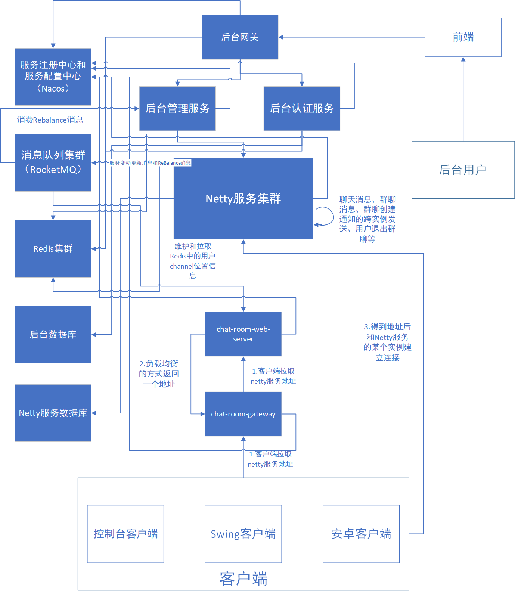

# 基于SpringCloud+Netty实现的在线网络聊天室


[TOC]

---


# 项目地址

https://github.com/maomao124/netty_chat_room


# 简介

基于SpringCloud+Netty实现的在线网络聊天室。netty服务是集群部署的，netty共享channel解决方案。

用户方面，有用户登录、用户注册、发送消息、发送群聊消息、创建群聊、加入群聊、查看群聊成员、退出群聊等功能；

后台方面，有登录次数统计、登录UV统计、注册统计、消息发送统计、群聊消息发送统计、群聊创建统计、Netty服务ReBalance、用户管理、后台用户、资源、角色、菜单、组织、岗位管理、后台用户认证和鉴权等功能。


# 后端模块架构


```sh
authority                    #聚合工程，用于聚合parent、apps、tools等模块
├── parent				     # 父工程，nacos配置及依赖包管理
├── apps					 # 应用目录
	├── auth				 # 权限服务父工程
		├── auth-entity      # 权限实体
		├── auth-server      # 权限服务
	├── gateway			     # 后台网关服务
	├──chat-room             # 在线聊天室应用
	    ├──chat-room-client-api        # 客户端api模块，放不同类型、不同平台客户端的公共代码的模块
	    ├──chat-room-common            # 在线聊天室公共模块，放客户端和服务端公共代码的模块
	    ├──chat-room-console-client    # 在线聊天室控制台客户端
	    ├──chat-room-console-test-client   # 在线聊天室控制台压力测试客户端(不提供给用户使用)
	    ├──chat-room-gateway           # 在线聊天室用户http服务网关
	    ├──chat-room-manage            # 聊天室后台管理服务和统计服务
	    ├──chat-room-netty-server      # 在线聊天室netty服务
	    ├──chat-room-server-api        # 服务端api模块，放不同类型、不同平台服务端的公共代码的模块
	    ├──chat-room-swing-client      # 在线聊天室java SWing客户端
	    ├──chat-room-web-server        # 在线聊天室web服务 ，向用户提供http服务
└── tools				     # 工具工程
	├── tools-common		 # 基础组件：基础配置类、函数、常量、统一异常处理、undertow服务器
	├── tools-core		     # 核心组件：基础实体、返回对象、上下文、异常处理、分布式锁、函数、树
	├── tools-databases	     # 数据源组件：数据源配置、数据权限、查询条件等
	├── tools-dozer		     # 对象转换：dozer配置、工具
	├── tools-redis-cache    # redis分布式缓存工具类和分布式锁服务，缓存工具类解决著名的3个缓存问题
	├── tools-j2cache	     # 缓存组件：j2cache、redis缓存
	├── tools-jwt            # JWT组件：配置、属性、工具
	├── tools-log	         # 日志组件：日志实体、事件、拦截器、工具
	├── tools-swagger2	     # 文档组件：knife4j文档
	├── tools-user           # 用户上下文：用户注解、模型和工具，当前登录用户信息注入模块
	├── tools-validator	     # 表单验证： 后台表单规则验证
	├── tools-xss		     # xss防注入组件
```


# 架构设计




# 技术

* **注册中心和配置中心：Nacos**
* **消息队列：RocketMQ**
* **关系数据库：MYSQL**
* **缓存服务：Redis**
* **二级缓存：j2cache**
* **负载均衡远程调用：Feign**
* **定向调用：RestTemplate**
* **网络框架：Netty**
* **对象转换：Dozer**
* **分布式锁：redisson**
* **防XSS攻击：antisamy**
* **接口文档：knife4j swagger**
* **令牌生成和解析：jjwt**
* **网关：zuul**
* **验证码生成：captcha**
* **......**


# 重要流程

java代码有48713行，只列举一部分重要的流程


## 客户端连接流程

1. 客户端请求http服务网关，拉取netty服务实例地址
2. http服务网关负载均衡到chat-room-web-server服务
3. chat-room-web-server服务从Nacos拉取chat-room-netty-server服务实例列表，并通过负载均衡的方式返回其中一个实例（有二级缓存）
4. 客户端接收到网关响应的服务实例
5. 客户端根据响应的实例地址连接该实例


### 控制台客户端部分代码

```java
public static void main(String[] args)
    {
        RestfulHTTP restfulHTTP = MainApplication.getRestfulHTTP();
        System.out.println("服务器URL：" + ClientConfig.getServerUrl());
        System.out.println("正在等待服务器响应...");
        //todo:超时重试，错误重试，有限重试
        R<String> r = restfulHTTP.GET(R.class, ClientConfig.getServerUrl(), null, null);
        if (r.getIsError())
        {
            //错误
            System.out.println("获取netty服务时错误：" + r.getMsg());
            Toolkit.getDefaultToolkit().beep();
            return;
        }
        Server server = r.getData(Server.class);
        String ip = server.getIp();
        Integer port = server.getPort();
        System.out.println(ip + ":" + port);

        NioEventLoopGroup group = new NioEventLoopGroup();
        LoggingHandler LOGGING_HANDLER = new LoggingHandler(LogLevel.DEBUG);
        ClientMessageCodecSharable clientMessageCodecSharable = new ClientMessageCodecSharable();

        PingResponseMessageHandler pingResponseMessageHandler = new PingResponseMessageHandler();
        LoginResponseMessageHandler loginResponseMessageHandler = new LoginResponseMessageHandler();
        RegisterResponseMessageHandler registerResponseMessageHandler = new RegisterResponseMessageHandler();
        ChatResponseMessageHandler chatResponseMessageHandler = new ChatResponseMessageHandler();
        GroupChatResponseMessageHandler groupChatResponseMessageHandler = new GroupChatResponseMessageHandler();
        GroupCreateResponseMessageHandler groupCreateResponseMessageHandler = new GroupCreateResponseMessageHandler();
        GroupMembersResponseMessageHandler groupMembersResponseMessageHandler = new GroupMembersResponseMessageHandler();
        GroupJoinResponseMessageHandler groupJoinResponseMessageHandler = new GroupJoinResponseMessageHandler();
        GroupQuitResponseMessageHandler groupQuitResponseMessageHandler = new GroupQuitResponseMessageHandler();

        Bootstrap bootstrap = new Bootstrap();
        ChannelFuture channelFuture = bootstrap.group(group)
                .channel(NioSocketChannel.class)
                .handler(new ChannelInitializer<NioSocketChannel>()
                {
                    @Override
                    protected void initChannel(NioSocketChannel ch) throws Exception
                    {
                        ch.pipeline().addLast(LOGGING_HANDLER)
                                .addLast(new ProcotolFrameDecoder())
                                .addLast(clientMessageCodecSharable)
                                .addLast(pingResponseMessageHandler)
                                .addLast(loginResponseMessageHandler)
                                .addLast(registerResponseMessageHandler)
                                .addLast(chatResponseMessageHandler)
                                .addLast(groupChatResponseMessageHandler)
                                .addLast(groupCreateResponseMessageHandler)
                                .addLast(groupMembersResponseMessageHandler)
                                .addLast(groupJoinResponseMessageHandler)
                                .addLast(groupQuitResponseMessageHandler);
                    }
                }).connect(new InetSocketAddress(ip, port));

        channel = channelFuture.channel();

        thread = new LoginAndRegisterThread(channel);

        channelFuture.addListener(new GenericFutureListener<Future<? super Void>>()
        {
            @Override
            public void operationComplete(Future<? super Void> future) throws Exception
            {
                if (future.isSuccess())
                {
                    System.out.println("客户端启动成功");
                    thread.start();
                }
                else
                {
                    String message = future.cause().getMessage();
                    System.out.println("错误：" + message);
                    Toolkit.getDefaultToolkit().beep();
                }
            }
        });

        channel.closeFuture().addListener(new GenericFutureListener<Future<? super Void>>()
        {
            @Override
            public void operationComplete(Future<? super Void> future) throws Exception
            {
                group.shutdownGracefully();
            }
        });

        Runtime.getRuntime().addShutdownHook(new Thread(new Runnable()
        {
            @Override
            public void run()
            {
                try
                {
                    channel.close();
                }
                catch (Exception ignored)
                {

                }
                try
                {
                    group.shutdownGracefully();
                }
                catch (Exception ignored)
                {

                }
            }
        }));
}
```


### chat-room-web-server服务部分源码

```java
package mao.chat_room_web_server.service.impl;

import com.alibaba.fastjson.JSON;
import com.alibaba.fastjson.JSONArray;
import lombok.SneakyThrows;
import lombok.extern.slf4j.Slf4j;
import mao.chat_room_common.entity.Server;
import mao.chat_room_server_api.constants.CacheConstants;
import mao.chat_room_server_api.constants.ServerConstants;
import mao.chat_room_server_api.constants.UrlConstants;
import mao.chat_room_server_api.utils.ClusterUtils;
import mao.chat_room_web_server.service.NettyService;
import mao.tools_core.base.R;
import mao.tools_core.exception.BizException;
import net.oschina.j2cache.CacheChannel;
import net.oschina.j2cache.CacheObject;
import org.springframework.cloud.client.ServiceInstance;
import org.springframework.stereotype.Service;
import org.springframework.web.client.RestTemplate;

import javax.annotation.Resource;
import java.nio.file.Path;
import java.util.ArrayList;
import java.util.List;
import java.util.Random;
import java.util.concurrent.*;
import java.util.concurrent.atomic.AtomicBoolean;

/**
 * Project name(项目名称)：netty_chat_room
 * Package(包名): mao.chat_room_web_server.service.impl
 * Class(类名): NettyServiceImpl
 * Author(作者）: mao
 * Author QQ：1296193245
 * GitHub：https://github.com/maomao124/
 * Date(创建日期)： 2023/4/1
 * Time(创建时间)： 20:49
 * Version(版本): 1.0
 * Description(描述)： 无
 */

@Slf4j
@Service
public class NettyServiceImpl implements NettyService
{

    @Resource
    private CacheChannel cacheChannel;

    @Resource
    private ClusterUtils clusterUtils;

    @Resource
    private RestTemplate restTemplate;

    private final ThreadPoolExecutor threadPoolExecutor = new ThreadPoolExecutor(150,
            150, 0L, TimeUnit.MILLISECONDS,
            new LinkedBlockingQueue<Runnable>(100));


    /**
     * 得到int随机数
     *
     * @param min 最小值
     * @param max 最大值
     * @return int
     */
    public static int getIntRandom(int min, int max)
    {
        if (min > max)
        {
            min = max;
        }
        Random random = new Random();
        return random.nextInt(max - min + 1) + min;
    }

    @SneakyThrows
    @Override
    public Server getNettyServerAddress()
    {
        //得到实例别表
        CacheObject cacheObject = cacheChannel.get(CacheConstants.chat_server_key, "1");
        //判断是否为空
        if (cacheObject == null || cacheObject.getValue() == null)
        {
            //空，需要加载
            List<ServiceInstance> serviceInstances = clusterUtils.getServiceInstances(ServerConstants.CHAT_ROOM_NETTY_SERVER);
            if (serviceInstances == null || serviceInstances.size() == 0)
            {
                throw BizException.wrap("无法获取聊天服务器地址！请稍后在试");
            }
            //不是空
            int size = serviceInstances.size();
            CountDownLatch countDownLatch = new CountDownLatch(size);
            List<Server> list = new ArrayList<>(size);
            log.debug("加载服务实例");
            AtomicBoolean isSuccess = new AtomicBoolean(true);
            for (ServiceInstance serviceInstance : serviceInstances)
            {
                threadPoolExecutor.submit(() ->
                {
                    try
                    {
                        String host = serviceInstance.getHost();
                        int port = serviceInstance.getPort();
                        String url = UrlConstants.buildGetPortUrl(
                                serviceInstance.getHost() + ":" + port);
                        R r = restTemplate.getForObject(url, R.class);
                        if (r.getIsError())
                        {
                            log.warn(r.getMsg());
                            isSuccess.set(false);
                        }
                        else
                        {
                            Integer nettyPort = Integer.valueOf(r.getData().toString());
                            Server server = new Server()
                                    .setIp(host)
                                    .setPort(nettyPort);
                            synchronized (list)
                            {
                                list.add(server);
                            }
                        }
                    }
                    finally
                    {
                        countDownLatch.countDown();
                    }

                });
            }
            countDownLatch.await();
            if (isSuccess.get())
            {
                //请求成功
                //判断是否有数据
                if (list.size() == 0)
                {
                    //无数据
                    throw BizException.wrap("netty服务集群暂时都不可用，请稍后再试");
                }
                String json = JSON.toJSONString(list);
                log.debug(json);
                cacheChannel.set(CacheConstants.chat_server_key, "1", json);
                return list.get(getIntRandom(0, list.size() - 1));
            }
            else
            {
                if (list.size() == 0)
                {
                    throw BizException.wrap("无法获取聊天服务器地址！请稍后在试");
                }
                else
                {
                    return list.get(getIntRandom(0, list.size() - 1));
                }
            }
        }
        else
        {
            //不为空
            String json = cacheObject.getValue().toString();
            List<Server> list = JSON.parseArray(json, Server.class);
            return list.get(getIntRandom(0, list.size() - 1));
        }
    }

    @Override
    public void removeCache()
    {
        cacheChannel.clear(CacheConstants.chat_server_key);
    }
}
```


## 注册流程

1. 客户端向netty服务发起注册消息包，包含用户名和密码
2. 服务端判断用户名是否为空
3. 服务端判断密码是否为空
4. 服务端判断用户名长度是否小于3位
5. 服务端判断密码长度是否小于6位
6. 服务端判断是否为保留字段
7. 服务端查询数据库
8. 服务端判断用户名是否存在，如果存在，用户名已被占用
9. 服务端将数据插入到数据库
10. 服务端返回数据给客户端


### 用户注册请求入栈消息处理器

```java
package mao.chat_room_netty_server.handler_cluster;

import io.netty.channel.ChannelHandler;
import lombok.extern.slf4j.Slf4j;
import mao.chat_room_netty_server.handler.RegisterRequestMessageHandler;
import mao.chat_room_netty_server.service.RedisService;
import mao.chat_room_netty_server.service.UserService;
import mao.chat_room_netty_server.session.GroupSession;
import mao.chat_room_netty_server.session.Session;
import org.springframework.stereotype.Service;

import javax.annotation.Resource;

/**
 * Project name(项目名称)：netty_chat_room
 * Package(包名): mao.chat_room_netty_server.handler_cluster
 * Class(类名): ClusterRegisterRequestMessageHandler
 * Author(作者）: mao
 * Author QQ：1296193245
 * GitHub：https://github.com/maomao124/
 * Date(创建日期)： 2023/4/8
 * Time(创建时间)： 14:42
 * Version(版本): 1.0
 * Description(描述)： 集群用户注册请求入栈消息处理器
 */

@Slf4j
@Service
@ChannelHandler.Sharable
public class ClusterRegisterRequestMessageHandler extends RegisterRequestMessageHandler
{
    @Resource
    private UserService userService;

    @Resource
    private Session session;

    @Resource
    private GroupSession groupSession;

    @Resource
    private RedisService redisService;
}
```


```java
package mao.chat_room_netty_server.handler;

import io.netty.channel.ChannelHandler;
import io.netty.channel.ChannelHandlerContext;
import io.netty.channel.SimpleChannelInboundHandler;
import lombok.extern.slf4j.Slf4j;
import mao.chat_room_common.message.RegisterRequestMessage;
import mao.chat_room_common.message.RegisterResponseMessage;
import mao.chat_room_netty_server.service.RedisService;
import mao.chat_room_netty_server.service.UserService;
import mao.chat_room_netty_server.session.GroupSession;
import mao.chat_room_netty_server.session.Session;
import mao.tools_core.exception.BizException;
import org.springframework.stereotype.Service;

import javax.annotation.Resource;

/**
 * Project name(项目名称)：netty_chat_room
 * Package(包名): mao.chat_room_netty_server.handler
 * Class(类名): RegisterRequestMessageHandler
 * Author(作者）: mao
 * Author QQ：1296193245
 * GitHub：https://github.com/maomao124/
 * Date(创建日期)： 2023/3/30
 * Time(创建时间)： 15:13
 * Version(版本): 1.0
 * Description(描述)： 用户注册请求入栈消息处理器
 */

@Slf4j
//@Service
@ChannelHandler.Sharable
public class RegisterRequestMessageHandler extends SimpleChannelInboundHandler<RegisterRequestMessage>
{
    @Resource
    private UserService userService;

    @Resource
    private Session session;

    @Resource
    private GroupSession groupSession;

    @Resource
    private RedisService redisService;


    @Override
    protected void channelRead0(ChannelHandlerContext ctx,
                                RegisterRequestMessage registerRequestMessage) throws Exception
    {
        String username = registerRequestMessage.getUsername();
        String password = registerRequestMessage.getPassword();
        try
        {
            boolean register = userService.register(username, password);
            if (register)
            {
                //注册成功
                //响应
                ctx.writeAndFlush(RegisterResponseMessage.success()
                        .setReason("注册成功！ 请登录")
                        .setSequenceId(registerRequestMessage.getSequenceId()));
                //统计
                redisService.registerCount();
            }
            else
            {
                //注册失败
                ctx.writeAndFlush(RegisterResponseMessage.fail("注册失败!")
                        .setSequenceId(registerRequestMessage.getSequenceId()));
            }
        }
        catch (BizException e)
        {
            //错误消息
            String message = e.getMessage();
            //注册失败
            ctx.writeAndFlush(RegisterResponseMessage.fail(message)
                    .setSequenceId(registerRequestMessage.getSequenceId()));
        }
        catch (Exception e)
        {
            log.error("服务器错误：", e);
            ctx.writeAndFlush(RegisterResponseMessage.fail("服务器错误! 请稍后在试！")
                    .setSequenceId(registerRequestMessage.getSequenceId()));
        }
    }
}
```


### 用户服务实现类

```java
@Override
@Transactional
public boolean register(String username, String password)
{
    if (username == null || username.equals(""))
    {
        throw new BizException("用户名不能为空");
    }
    if (password == null || password.equals(""))
    {
        throw new BizException("密码不能为空");
    }
    if (username.length() < 3)
    {
        throw new BizException("用户名长度不能小于3位");
    }
    if (password.length() < 6)
    {
        throw new BizException("密码长度不能小于6位");
    }
    //判断是否为保留字段
    if (username.equals("host"))
    {
        throw new BizException("用户名\"host\"为系统保留字段，不能使用");
    }
    //查询数据库
    User user = this.getOne(Wraps.<User>lbQ().eq(User::getUsername, username));
    //如果为空，就不存在
    if (user != null)
    {
        //判断用户名是否存在
        if (user.getUsername().equals(username))
        {
            throw new BizException("该用户名\"" + username + "\"已被占用! 换一个用户名吧");
        }
    }
    User user1 = new User()
            .setUsername(username)
            .setPassword(passwordEncoderService.encoder(password))
            .setStatus(true)
            .setRegisterTime(LocalDateTime.now());
    //插入
    return this.save(user1);
}
```


## 登录流程

1. 客户端向netty服务发起登录消息包，包含用户名和密码
2. 服务端检查登录状态，禁止在多台设备上同时登录
3. 服务端判断用户名是否为空
4. 服务端判断密码是否为空
5. 服务端判断用户名长度是否小于3位
6. 服务端判断密码长度是否小于6位
7. 服务端查询数据库
8. 服务端判断查询是否为空，如果为空，用户名不存在
9. 服务端判断判断密码错误次数是否大于3次

   1. 判断密码输入间隔是否小于10分钟

   2. 如果是，证明10分钟内尝试过，返回密码错误次数过多，请10分钟后再试！

   3. 如果不是，执行下一步
10. 验证密码是否正确
11. 判断启用状态，如果为非启用状态，证明该账号已被禁用
12. 更新登录时间
13. 服务端响应数据给客户端


### 用户登录请求入栈消息处理器

```java
package mao.chat_room_netty_server.handler_cluster;

import io.netty.channel.ChannelHandler;
import lombok.extern.slf4j.Slf4j;
import mao.chat_room_netty_server.handler.LoginRequestMessageHandler;
import mao.chat_room_netty_server.service.RedisService;
import mao.chat_room_netty_server.service.UserService;
import mao.chat_room_netty_server.session.GroupSession;
import mao.chat_room_netty_server.session.Session;
import org.springframework.stereotype.Service;

import javax.annotation.Resource;

/**
 * Project name(项目名称)：netty_chat_room
 * Package(包名): mao.chat_room_netty_server.handler_cluster
 * Class(类名): ClusterLoginRequestMessageHandler
 * Author(作者）: mao
 * Author QQ：1296193245
 * GitHub：https://github.com/maomao124/
 * Date(创建日期)： 2023/4/8
 * Time(创建时间)： 14:39
 * Version(版本): 1.0
 * Description(描述)： 集群用户登录请求入栈消息处理器
 */

@Slf4j
@Service
@ChannelHandler.Sharable
public class ClusterLoginRequestMessageHandler extends LoginRequestMessageHandler
{
    @Resource
    private UserService userService;

    @Resource
    private Session session;

    @Resource
    private GroupSession groupSession;

    @Resource
    private RedisService redisService;

}
```


```java
package mao.chat_room_netty_server.handler;

import io.netty.channel.ChannelHandler;
import io.netty.channel.ChannelHandlerContext;
import io.netty.channel.SimpleChannelInboundHandler;
import lombok.extern.slf4j.Slf4j;
import mao.chat_room_common.message.GroupChatResponseMessage;
import mao.chat_room_common.message.LoginRequestMessage;
import mao.chat_room_common.message.LoginResponseMessage;
import mao.chat_room_netty_server.service.RedisService;
import mao.chat_room_netty_server.service.UserService;
import mao.chat_room_netty_server.session.GroupSession;
import mao.chat_room_netty_server.session.Session;
import mao.chat_room_server_api.entity.User;
import mao.tools_core.exception.BizException;
import org.springframework.stereotype.Service;

import javax.annotation.Resource;

/**
 * Project name(项目名称)：netty_chat_room
 * Package(包名): mao.chat_room_netty_server.handler
 * Class(类名): LoginRequestMessageHandler
 * Author(作者）: mao
 * Author QQ：1296193245
 * GitHub：https://github.com/maomao124/
 * Date(创建日期)： 2023/3/30
 * Time(创建时间)： 14:59
 * Version(版本): 1.0
 * Description(描述)： 用户登录请求入栈消息处理器
 */

@Slf4j
//@Service
@ChannelHandler.Sharable
public class LoginRequestMessageHandler extends SimpleChannelInboundHandler<LoginRequestMessage>
{

    @Resource
    private UserService userService;

    @Resource
    private Session session;

    @Resource
    private GroupSession groupSession;

    @Resource
    private RedisService redisService;

    @Override
    protected void channelRead0(ChannelHandlerContext ctx, LoginRequestMessage loginRequestMessage) throws Exception
    {
        String username = loginRequestMessage.getUsername();
        String password = loginRequestMessage.getPassword();

        //检查登录状态
        if (session.isLogin(username))
        {
            //已登录
            ctx.writeAndFlush(LoginResponseMessage.fail("禁止在多台设备上同时登录!")
                    .setSequenceId(loginRequestMessage.getSequenceId()));
            return;
        }
        try
        {
            User user = userService.login(username, password);
            //登录成功,绑定
            session.bind(ctx.channel(), username);
            //响应
            ctx.writeAndFlush(LoginResponseMessage.success()
                    .setUsername(username)
                    .setSequenceId(loginRequestMessage.getSequenceId()));
            log.debug("用户" + username + "登录成功");
            //登录统计
            redisService.loginCount(username);
        }
        catch (BizException e)
        {
            //得到异常消息
            String message = e.getMessage();
            //登录失败
            ctx.writeAndFlush(LoginResponseMessage.fail(message)
                    .setSequenceId(loginRequestMessage.getSequenceId()));
            log.debug("用户" + username + "登录失败");

        }
        catch (Exception e)
        {
            log.error("登录过程中服务器错误：", e);
            ctx.writeAndFlush(LoginResponseMessage.fail("服务器错误! 请稍后在试！")
                    .setSequenceId(loginRequestMessage.getSequenceId()));
        }
    }
}
```


### 用户服务实现类

```java
@Resource
private PasswordEncoderService passwordEncoderService;

@Resource
private TransactionTemplate transactionTemplate;

@Resource
private PlatformTransactionManager platformTransactionManager;

@Resource
private DozerUtils dozerUtils;

@Override
@Transactional(noRollbackFor = {BizException.class})
public User login(String username, String password)
{
    if (username == null || username.equals(""))
    {
        throw new BizException("用户名不能为空");
    }
    if (password == null || password.equals(""))
    {
        throw new BizException("密码不能为空");
    }
    if (username.length() < 3)
    {
        throw new BizException("用户名长度不能小于3位");
    }
    if (password.length() < 6)
    {
        throw new BizException("密码长度不能小于6位");
    }
    //查询数据库
    User user = this.getOne(Wraps.<User>lbQ().eq(User::getUsername, username));
    if (user == null)
    {
        throw new BizException("用户名不存在");
    }
    //判断密码错误次数是否大于3次
    if (user.getPasswordErrorNum() > 3)
    {
        //判断密码输入间隔是否小于10分钟
        LocalDateTime passwordErrorLastTime = user.getPasswordErrorLastTime();
        LocalDateTime now = LocalDateTime.now();
        //加10分钟,是否晚于现在时间，如果是，证明10分钟内尝试过
        if (passwordErrorLastTime.plusMinutes(10).isAfter(now))
        {
            //第四次输入可能会跳过
            throw new BizException("密码错误次数过多，请10分钟后再试！");
        }
    }

    //验证密码是否正确
    boolean verification = passwordEncoderService.verification(password, user.getPassword());
    if (!verification)
    {
        //密码错误
        this.update(Wraps.<User>lbU()
                .eq(User::getUsername, username)
                //密码错误时间
                .set(User::getPasswordErrorLastTime, LocalDateTime.now())
                //密码错误次数
                .set(User::getPasswordErrorNum, user.getPasswordErrorNum() + 1));
        //提交事务
        throw new BizException("密码错误");
    }
    //密码正确,判断启用状态
    if (!user.getStatus())
    {
        //未启用
        throw new BizException("该账号已被禁用");
    }
    //更新登录时间
    this.update(Wraps.<User>lbU()
            .eq(User::getUsername, username)
            .set(User::getLastLoginTime, LocalDateTime.now())
            //将密码错误次数更改成0
            .set(User::getPasswordErrorNum, 0));
    //密码设空并返回
    return user.setPassword(null);
}
```


## 消息发送流程

1. 客户端向netty服务发起消息发送请求消息包，包含from（谁发送的）、to（发送给谁）和content（消息内容）

2. netty服务端接收到数据包，处理数据包，进入聊天请求入栈消息处理器

3. 服务端检查登录状态

4. 服务端判断from是否为空

5. 服务端判断to是否为空

6. 服务端校验身份

7. 服务端判断是否是自己发送给自己

8. 服务端查询对方用户在当前实例上是否存在

9. 如果存在，证明对方用户在本实例上且在线，直接向对方channel写数据，并响应给消息发送者，统计消息发送次数，结束

10. 如果不存在，证明本地不在线或者不存在，需要往下执行

11. 从redis上查询其他实例的信息，得到对方用户在那一台实例上（host），判断用户是否在线

12. 如果其他实例都不在线或者不存在，响应给发送者"对方用户不存在或者不在线"

13. 如果其他实例在线，根据查询到的host发起http请求，让其它实例处理

14. 其它实例发送给接收者，如果没有问题，就会响应给服务调用者成功的状态

15. 服务端根据http请求结果，响应给发送者相应的结果

16. 如果是失败，响应给发送者"服务器错误"的错误消息

17. 如果是成功，响应给消息发送者成功的消息，统计消息发送次数，结束

    


### 聊天请求入栈消息处理器

```java
package mao.chat_room_netty_server.handler_cluster;

import io.netty.channel.Channel;
import io.netty.channel.ChannelHandler;
import io.netty.channel.ChannelHandlerContext;
import lombok.extern.slf4j.Slf4j;
import mao.chat_room_common.message.ChatRequestMessage;
import mao.chat_room_common.message.ChatResponseMessage;
import mao.chat_room_netty_server.handler.ChatRequestMessageHandler;
import mao.chat_room_netty_server.service.RedisService;
import mao.chat_room_netty_server.session.Session;
import mao.chat_room_server_api.constants.UrlConstants;
import mao.tools_core.base.R;
import org.springframework.http.ResponseEntity;
import org.springframework.stereotype.Service;
import org.springframework.web.client.RestTemplate;

import javax.annotation.Resource;

/**
 * Project name(项目名称)：netty_chat_room
 * Package(包名): mao.chat_room_netty_server.handler_cluster
 * Class(类名): ClusterChatRequestMessageHandler
 * Author(作者）: mao
 * Author QQ：1296193245
 * GitHub：https://github.com/maomao124/
 * Date(创建日期)： 2023/4/1
 * Time(创建时间)： 16:09
 * Version(版本): 1.0
 * Description(描述)： 聊天请求入栈消息处理器
 */

@Slf4j
@Service //这里应该添加Service而不是Component
@ChannelHandler.Sharable
public class ClusterChatRequestMessageHandler extends ChatRequestMessageHandler
{
    @Resource
    private Session session;

    @Resource
    private RedisService redisService;

    @Resource
    private RestTemplate restTemplate;

    /**
     * 通道读事件触发
     *
     * @param ctx                ctx
     * @param chatRequestMessage 聊天请求消息
     * @throws Exception 异常
     */
    @Override
    protected void channelRead0(ChannelHandlerContext ctx,
                                ChatRequestMessage chatRequestMessage) throws Exception
    {
        //检查登录状态
        if (!session.isLogin(ctx.channel()))
        {
            //未登录
            ctx.writeAndFlush(ChatResponseMessage.fail("请登录")
                    .setSequenceId(chatRequestMessage.getSequenceId()));
            return;
        }

        //谁发的
        String from = chatRequestMessage.getFrom();
        //发给谁
        String to = chatRequestMessage.getTo();

        //判断from是否为空
        if (from == null || from.equals(""))
        {
            ctx.writeAndFlush(ChatResponseMessage.fail("缺失必要参数")
                    .setSequenceId(chatRequestMessage.getSequenceId()));
            return;
        }
        //判断to是否为空
        if (to == null || to.equals(""))
        {
            ctx.writeAndFlush(ChatResponseMessage.fail("缺失必要参数")
                    .setSequenceId(chatRequestMessage.getSequenceId()));
            return;
        }
        //校验身份
        if (!session.getUsername(ctx.channel()).equals(from))
        {
            ctx.writeAndFlush(ChatResponseMessage.fail("身份验证失败！")
                    .setSequenceId(chatRequestMessage.getSequenceId()));
            return;
        }

        Channel channel = session.getChannel(to);
        if (to.equals(from))
        {
            //自己发送给自己
            ctx.writeAndFlush(ChatResponseMessage.fail("不能发送给自己")
                    .setSequenceId(chatRequestMessage.getSequenceId()));
            return;
        }
        if (channel == null)
        {
            //为空，本地不在线或者不存在
            //查询其他实例
            String host = redisService.getUserHost(to);
            if (host == null)
            {
                //其他实例都不在线
                ctx.writeAndFlush(ChatResponseMessage.fail("对方用户\"" + to + "\"不存在或者不在线")
                        .setSequenceId(chatRequestMessage.getSequenceId()));
                return;
            }
            //其他实例在线
            //发起请求
            //url
            String url = UrlConstants.buildChatRequestMessageUrl(host);
            R r = restTemplate.postForObject(url, chatRequestMessage, R.class);
            if (r.getIsError())
            {
                //错误
                ctx.writeAndFlush(ChatResponseMessage.fail("服务器错误")
                        .setSequenceId(chatRequestMessage.getSequenceId()));
            }
            else
            {
                //写入到自己客户端
                ctx.writeAndFlush(ChatResponseMessage
                        .success(from, null)
                        .setSequenceId(chatRequestMessage.getSequenceId()));
                //聊天统计
                redisService.chatCount();
            }

        }
        else
        {
            //在线
            log.debug(from + "--->" + chatRequestMessage.getTo());
            //写入到对方客户端
            channel.writeAndFlush(ChatResponseMessage
                    .success(from,
                            chatRequestMessage.getContent())
                    .setSequenceId(chatRequestMessage.getSequenceId()));
            //写入到自己客户端
            ctx.writeAndFlush(ChatResponseMessage
                    .success(from, null)
                    .setSequenceId(chatRequestMessage.getSequenceId()));
            //聊天统计
            redisService.chatCount();
        }
    }
}
```


### SessionClusterImpl类(implements Session) 的isLogin方法

```java
@Override
public boolean isLogin(String username)
{
    Channel channel = usernameChannelMap.get(username);
    if (channel != null)
    {
        return true;
    }
    //在本地未找到
    boolean hasLogin = redisService.hasLogin(username);
    if (hasLogin)
    {
        log.debug("用户" + username + "在其它服务实例上登录");
        return true;
    }
    log.debug("用户" + username + "未登录");
    return false;
}

@Override
public boolean isLogin(Channel channel)
{
    String username = channelUsernameMap.get(channel);
    if (username == null)
    {
        log.debug("用户" + channel + "未登录");
        return false;
    }
    return true;
}
```


### NettyController

```java
package mao.chat_room_netty_server.controller;

import io.swagger.annotations.Api;
import io.swagger.annotations.ApiOperation;
import lombok.extern.slf4j.Slf4j;
import mao.chat_room_common.message.ChatRequestMessage;
import mao.chat_room_common.message.GroupChatResponseMessage;
import mao.chat_room_common.message.GroupCreateResponseMessage;
import mao.chat_room_netty_server.service.NettyService;
import mao.chat_room_netty_server.session.Session;
import mao.chat_room_server_api.config.ServerConfig;
import mao.tools_core.base.BaseController;
import mao.tools_core.base.R;
import org.springframework.web.bind.annotation.*;

import javax.annotation.Resource;
import java.util.List;
import java.util.Map;

/**
 * Project name(项目名称)：netty_chat_room
 * Package(包名): mao.chat_room_netty_server.controller
 * Class(类名): NettyController
 * Author(作者）: mao
 * Author QQ：1296193245
 * GitHub：https://github.com/maomao124/
 * Date(创建日期)： 2023/4/1
 * Time(创建时间)： 16:41
 * Version(版本): 1.0
 * Description(描述)： netty消息接收controller
 */

@Slf4j
@Api(tags = "netty相关", value = "netty相关")
@RestController
public class NettyController extends BaseController
{

    @Resource
    private NettyService nettyService;

    @Resource
    private ServerConfig serverConfig;

    @Resource
    private Session session;

    /**
     * 发送聊天消息
     *
     * @param chatRequestMessage 聊天请求消息
     * @return {@link R}<{@link Boolean}>
     */
    @ApiOperation("发送聊天消息")
    @PostMapping("/send")
    public R<Boolean> send(@RequestBody ChatRequestMessage chatRequestMessage)
    {
        return nettyService.chatRequestMessageSend(chatRequestMessage);
    }

   ......
}
```


### NettyServiceImpl类的chatRequestMessageSend方法

```java
@Override
public R<Boolean> chatRequestMessageSend(ChatRequestMessage chatRequestMessage)
{
    log.debug("远程发起的聊天发送请求");
    //发给谁
    String to = chatRequestMessage.getTo();
    Channel channel = session.getChannel(to);
    if (channel == null)
    {
        //为空，不在线或者不存在
        return R.fail("对方用户\"" + to + "\"不存在或者不在线");
    }
    else
    {
        //在线
        log.debug(chatRequestMessage.getFrom() + "--->" + chatRequestMessage.getTo());
        //写入到对方客户端
        channel.writeAndFlush(ChatResponseMessage
                .success(chatRequestMessage.getFrom(),
                        chatRequestMessage.getContent())
                .setSequenceId(chatRequestMessage.getSequenceId()));
        //返回成功
        return R.success();
    }
}
```


## 群聊消息发送流程

1. 客户端向netty服务发起群聊消息发送请求消息包，包含content、groupName和from
2. netty服务端接收到数据包，处理数据包，进入集群群聊聊天请求入栈消息处理器
3. 服务端检查登录状态
4. 服务端判断from是否为空
5. 服务端校验身份
6. 服务端从redis上得到群聊的成员和成员位置和群聊位置
7. 服务端判断群聊是否存在
8. 如果群聊不存在，响应发送者错误消息"群聊已经不存在"，结束
9. 如果群聊存在，查询群聊的成员和成员位置
10. 判断自己是否在群聊里面
11. 如果自己不在群聊里面，证明未加入群聊，响应给发送者错误消息"请先加入该群聊"
12. 如果自己在群聊里面，需要根据群聊成员的位置分桶，key为host，value一个map，map里面key为用户名，value为为GroupChatResponseMessage
13. 遍历群聊成员，如果群聊成员在本实例上，自己发送给此成员，如果不存在，证明在其他实例上，或者不存在，添加到分桶
14. 遍历完成后根据分桶判断是否需要发起http请求
15. 如果不需要发起http请求，群聊聊天发送统计，结束
16. 如果需要发起http请求，遍历分桶，通过http请求发送至需要发送的实例上
17. 由其他实例发送给群聊成员
18. 都调用完成后，群聊聊天发送统计，结束


### 集群群聊聊天请求入栈消息处理器

```java
package mao.chat_room_netty_server.handler_cluster;

import io.netty.channel.Channel;
import io.netty.channel.ChannelHandler;
import io.netty.channel.ChannelHandlerContext;
import io.netty.channel.SimpleChannelInboundHandler;
import lombok.extern.slf4j.Slf4j;
import mao.chat_room_common.message.ChatResponseMessage;
import mao.chat_room_common.message.GroupChatRequestMessage;
import mao.chat_room_common.message.GroupChatResponseMessage;
import mao.chat_room_netty_server.entity.ClusterGroup;
import mao.chat_room_netty_server.handler.GroupChatRequestMessageHandler;
import mao.chat_room_netty_server.service.RedisService;
import mao.chat_room_netty_server.session.GroupSession;
import mao.chat_room_netty_server.session.Session;
import mao.chat_room_server_api.constants.UrlConstants;
import mao.tools_core.base.R;
import org.springframework.stereotype.Service;
import org.springframework.web.client.RestTemplate;

import javax.annotation.Resource;
import java.time.LocalDateTime;
import java.util.ArrayList;
import java.util.HashMap;
import java.util.List;
import java.util.Map;
import java.util.function.BiConsumer;

/**
 * Project name(项目名称)：netty_chat_room
 * Package(包名): mao.chat_room_netty_server.handler_cluster
 * Class(类名): ClusterGroupChatRequestMessageHandler
 * Author(作者）: mao
 * Author QQ：1296193245
 * GitHub：https://github.com/maomao124/
 * Date(创建日期)： 2023/4/7
 * Time(创建时间)： 18:16
 * Version(版本): 1.0
 * Description(描述)： 集群群聊聊天请求入栈消息处理器
 */

@Slf4j
@Service
@ChannelHandler.Sharable
public class ClusterGroupChatRequestMessageHandler extends GroupChatRequestMessageHandler
{

    @Resource
    private Session session;

    @Resource
    private GroupSession groupSession;

    @Resource
    private RedisService redisService;

    @Resource
    private RestTemplate restTemplate;

    @Override
    protected void channelRead0(ChannelHandlerContext ctx,
                                GroupChatRequestMessage groupChatRequestMessage) throws Exception
    {
        //检查登录状态
        if (!session.isLogin(ctx.channel()))
        {
            //未登录
            ctx.writeAndFlush(GroupChatResponseMessage.fail("请登录")
                    .setSequenceId(groupChatRequestMessage.getSequenceId()));
            return;
        }

        String groupName = groupChatRequestMessage.getGroupName();
        String content = groupChatRequestMessage.getContent();
        String from = groupChatRequestMessage.getFrom();

        //判断from是否为空
        if (from == null || from.equals(""))
        {
            ctx.writeAndFlush(ChatResponseMessage.fail("缺失必要参数")
                    .setSequenceId(groupChatRequestMessage.getSequenceId()));
            return;
        }

        //校验身份
        if (!session.getUsername(ctx.channel()).equals(from))
        {
            ctx.writeAndFlush(ChatResponseMessage.fail("身份验证失败！")
                    .setSequenceId(groupChatRequestMessage.getSequenceId()));
            return;
        }

        //得到群聊的成员和成员位置和群聊位置
        ClusterGroup clusterGroup = groupSession.getMembersAndHost(groupName);
        //判断群聊是否存在
        if (clusterGroup == null)
        {
            //不存在
            ctx.writeAndFlush(GroupChatResponseMessage.fail("群聊已经不存在")
                    .setSequenceId(groupChatRequestMessage.getSequenceId()));
            return;
        }
        //群聊存在
        //得到群聊的成员和成员位置
        Map<String, String> groupMembersAndHost = clusterGroup.getGroupMembersAndHost();
        //判断自己是否在里面
        if (groupMembersAndHost.get(from) == null)
        {
            //不在
            ctx.writeAndFlush(GroupChatResponseMessage.fail("请先加入该群聊")
                    .setSequenceId(groupChatRequestMessage.getSequenceId()));
            return;
        }
        //分桶,key为host，value一个map，map里面key为用户名，value为为GroupChatResponseMessage
        Map<String, Map<String, GroupChatResponseMessage>> map = new HashMap<>();
        //发给每一位成员的时间要一致
        LocalDateTime now = LocalDateTime.now();
        //这里并发很大，对于服务器而言，使用异步操作反而会因为线程的上下文切换而影响性能
        groupMembersAndHost.forEach(new BiConsumer<String, String>()
        {
            /**
             * 遍历
             *
             * @param username 用户名
             * @param host     用户的位置
             */
            @Override
            public void accept(String username, String host)
            {
                //在本实例内取，如果没有取到，证明在其他实例上，或者不存在
                Channel channel = session.getChannel(username);
                if (channel != null)
                {
                    //在本实例上
                    channel.writeAndFlush(GroupChatResponseMessage.success(from, content, groupName)
                            .setSequenceId(groupChatRequestMessage.getSequenceId())
                            .setTime(now));
                    log.debug("用户" + username + "在本实例内，直接发送");
                }
                else
                {
                    //不在本实例上，往桶里添加
                    //如果没有，就创建一个空的
                    Map<String, GroupChatResponseMessage> userMap =
                            map.computeIfAbsent(host, k -> new HashMap<>());
                    //构建
                    GroupChatResponseMessage groupChatResponseMessage =
                            (GroupChatResponseMessage) GroupChatResponseMessage
                                    .success(from, content, groupName)
                                    .setSequenceId(groupChatRequestMessage.getSequenceId())
                                    .setTime(now);
                    userMap.put(username, groupChatResponseMessage);
                    log.debug("用户" + username + "添加到分桶");
                }
            }
        });
        log.debug("分桶结果：" + map);
        //判断是否需要发起http请求
        if (map.size() != 0)
        {
            log.debug("准备发起请求");
            //这里并发很大，对于服务器而言，使用异步操作反而会因为线程的上下文切换而影响性能
            map.forEach(new BiConsumer<String, Map<String, GroupChatResponseMessage>>()
            {

                /**
                 * 遍历分桶
                 *
                 * @param host                        位置
                 * @param groupChatResponseMessageMap 群组聊天响应消息映射
                 */
                @Override
                public void accept(String host, Map<String, GroupChatResponseMessage> groupChatResponseMessageMap)
                {
                    //远程调用
                    String url = UrlConstants.buildGroupChatRequestMessageUrl(host);
                    log.debug("url:" + url);
                    log.debug("正在发起请求：" + host);
                    R r = restTemplate.postForObject(url, groupChatResponseMessageMap, R.class);
                    if (r.getIsError())
                    {
                        //错误
                        log.warn("发送群聊消息时出现错误:" + r.getMsg());
                    }
                    else
                    {
                        //正确
                        log.debug(host + "  ：请求完成");
                    }
                }
            });
        }
        //群聊聊天统计
        redisService.groupChatCount();
    }
}
```


### GroupSessionClusterImpl的getMembersAndHost方法

```java
@Override
public ClusterGroup getMembersAndHost(String name)
{
    Map<Object, Object> membersAndHost = redisService.getMembersAndHost(name);
    if (membersAndHost == null || membersAndHost.size() == 0)
    {
        return null;
    }
    String host = membersAndHost.get("host").toString();
    ClusterGroup clusterGroup = new ClusterGroup();
    clusterGroup.setGroupHost(host);
    membersAndHost.remove("host");
    Map<String, String> groupMembersAndHost = new HashMap<>(membersAndHost.size());
    membersAndHost.forEach((key, value) ->
    {
        String keyString = key.toString();
        String valueString = membersAndHost.get(key).toString();
        groupMembersAndHost.put(keyString, valueString);
    });
    return clusterGroup.setGroupMembersAndHost(groupMembersAndHost);
}
```


### RedisServiceImpl的getMembersAndHost方法

```java
@Override
public Map<Object, Object> getMembersAndHost(String name)
{
    String key = RedisConstants.chat_group_key + name;
    Map<Object, Object> entries = stringRedisTemplate.opsForHash().entries(key);
    log.debug("获取群聊：" + name + "的所有群成员：" + entries);
    return entries;
}
```


```java
package mao.chat_room_netty_server.controller;

import io.swagger.annotations.Api;
import io.swagger.annotations.ApiOperation;
import lombok.extern.slf4j.Slf4j;
import mao.chat_room_common.message.ChatRequestMessage;
import mao.chat_room_common.message.GroupChatResponseMessage;
import mao.chat_room_common.message.GroupCreateResponseMessage;
import mao.chat_room_netty_server.service.NettyService;
import mao.chat_room_netty_server.session.Session;
import mao.chat_room_server_api.config.ServerConfig;
import mao.tools_core.base.BaseController;
import mao.tools_core.base.R;
import org.springframework.web.bind.annotation.*;

import javax.annotation.Resource;
import java.util.List;
import java.util.Map;

/**
 * Project name(项目名称)：netty_chat_room
 * Package(包名): mao.chat_room_netty_server.controller
 * Class(类名): NettyController
 * Author(作者）: mao
 * Author QQ：1296193245
 * GitHub：https://github.com/maomao124/
 * Date(创建日期)： 2023/4/1
 * Time(创建时间)： 16:41
 * Version(版本): 1.0
 * Description(描述)： netty消息接收controller
 */

@Slf4j
@Api(tags = "netty相关", value = "netty相关")
@RestController
public class NettyController extends BaseController
{

    @Resource
    private NettyService nettyService;

    @Resource
    private ServerConfig serverConfig;

    @Resource
    private Session session;

    ......

    /**
     * 发送群聊聊天消息
     *
     * @param map {@link Map}<{@link String}, {@link GroupChatResponseMessage}>
     *            key为用户名，value为为GroupChatResponseMessage
     * @return {@link R}<{@link Boolean}>
     */
    @ApiOperation("发送群聊聊天消息")
    @PostMapping("/sendGroupChatMessage")
    public R<Boolean> sendGroupChatMessage(@RequestBody Map<String, GroupChatResponseMessage> map)
    {
        return nettyService.sendGroupChatMessage(map);
    }
    
    ......
}
```


### NettyServiceImpl的sendGroupChatMessage方法

```java
@Override
public R<Boolean> sendGroupChatMessage(Map<String, GroupChatResponseMessage> map)
{
    log.debug("发送群聊消息");
    map.forEach(new BiConsumer<String, GroupChatResponseMessage>()
    {
        /**
         * 遍历
         *
         * @param username                 用户名
         * @param groupChatResponseMessage 群组聊天响应消息
         */
        @Override
        public void accept(String username, GroupChatResponseMessage groupChatResponseMessage)
        {
            //根据用户名获取channel
            Channel channel = session.getChannel(username);
            //判断是否为空
            if (channel != null)
            {
                channel.writeAndFlush(groupChatResponseMessage);
            }
            else
            {
                //不存在
                log.info("发送群聊消息时，用户名：" + username + "无法发送");
            }
        }
    });
    return R.success();
}
```


## 群聊创建流程

1. 客户端向netty服务发起群聊创建请求消息包，包含groupName和members（群聊成员）
2. netty服务端接收到数据包，处理数据包，进入集群群聊创建请求入栈消息处理器
3. 服务端检查登录状态
4. 服务端判断群聊名称是否存在，如果已经存在，响应发送失败的消息，结束
5. 如果群聊不存在，分桶，key为host，value为GroupCreateResponseMessage列表，遍历成员列表
6. 判断某一个群聊成员是否在线（全局在线），如果不在线，什么都不用做，继续遍历
7. 如果群聊成员全局在线，证明群聊成员可能在本实例上在线，也有可能在其它实例上在线但是不在此实例上在线，添加至在线列表中，继续执行下一步
8. 判断群聊成员是否在本实例上在线
9. 如果群聊成员在本实例上在线，通知群聊成员您已被拉入群聊的消息
10. 如果群聊成员不在本实例上在线，证明群聊成员在其它实例上，加入到分桶中
11. 遍历完成后，根据分桶判断是否需要发起远程调用，如果不需要发起远程调用，证明所有的在线群聊成员都在此实例上
12. 响应群聊创建者在线成员列表，群聊创建统计，结束


### 群聊创建请求入栈消息处理器

```java
package mao.chat_room_netty_server.handler_cluster;

import io.netty.channel.Channel;
import io.netty.channel.ChannelHandler;
import io.netty.channel.ChannelHandlerContext;
import lombok.extern.slf4j.Slf4j;
import mao.chat_room_common.message.GroupCreateRequestMessage;
import mao.chat_room_common.message.GroupCreateResponseMessage;
import mao.chat_room_netty_server.handler.GroupCreateRequestMessageHandler;
import mao.chat_room_netty_server.service.RedisService;
import mao.chat_room_netty_server.session.Group;
import mao.chat_room_netty_server.session.GroupSession;
import mao.chat_room_netty_server.session.Session;
import org.springframework.stereotype.Service;

import javax.annotation.Resource;
import java.util.*;

/**
 * Project name(项目名称)：netty_chat_room
 * Package(包名): mao.chat_room_netty_server.handler_cluster
 * Class(类名): ClusterGroupCreateRequestMessageHandler
 * Author(作者）: mao
 * Author QQ：1296193245
 * GitHub：https://github.com/maomao124/
 * Date(创建日期)： 2023/4/3
 * Time(创建时间)： 21:54
 * Version(版本): 1.0
 * Description(描述)： 群聊创建请求入栈消息处理器
 */

@Slf4j
@Service
@ChannelHandler.Sharable
public class ClusterGroupCreateRequestMessageHandler extends GroupCreateRequestMessageHandler
{
    @Resource
    private GroupSession groupSession;

    @Resource
    private Session session;

    @Resource
    private RedisService redisService;

    @Override
    protected void channelRead0(ChannelHandlerContext ctx,
                                GroupCreateRequestMessage groupCreateRequestMessage) throws Exception
    {
        //检查登录状态
        if (!session.isLogin(ctx.channel()))
        {
            //未登录
            ctx.writeAndFlush(GroupCreateResponseMessage.fail("请登录")
                    .setSequenceId(groupCreateRequestMessage.getSequenceId()));
            return;
        }

        //组名
        String groupName = groupCreateRequestMessage.getGroupName();
        //群成员
        Set<String> members = groupCreateRequestMessage.getMembers();
        boolean hasGroup = groupSession.hasGroup(groupName);
        //判断群聊名称是否存在
        if (hasGroup)
        {
            //已存在
            ctx.writeAndFlush(GroupCreateResponseMessage.fail("群聊名称\"" + groupName + "\"已经存在! 换个名字吧")
                    .setSequenceId(groupCreateRequestMessage.getSequenceId()));
        }
        else
        {
            //不存在
            //创建群聊
            Group group = groupSession.createGroup(groupName, members);
            //在线的成员列表
            Set<String> members1 = group.getMembers();
            ctx.writeAndFlush(GroupCreateResponseMessage.success(members1)
                    .setSequenceId(groupCreateRequestMessage.getSequenceId()));
            //群聊创建统计
            redisService.groupCreateCount();
        }
    }
}
```


### GroupSessionClusterImpl的hasGroup方法

```java
@Override
public boolean hasGroup(String name)
{
    Group group = groupMap.get(name);
    if (group != null)
    {
        //本地存在
        return true;
    }
    //本地不存在
    //查询redis
    return redisService.hasGroup(name);
}
```


### GroupSessionClusterImpl的createGroup方法

```java
@Override
public Group createGroup(String name, Set<String> members)
{
    log.debug("创建群聊：" + name + "，成员：" + members);
    Set<String> members1 = redisService.createGroup(name, members, host);
    Group group = new Group(name, members1);
    groupMap.putIfAbsent(name, group);
    return group;
}
```


### RedisServiceImpl的createGroup方法

```java
@SneakyThrows
@Override
public Set<String> createGroup(String name, Set<String> members, String host)
{
    String key = RedisConstants.chat_group_key + name;
    String key2 = RedisConstants.chat_group_list_key + host;
    stringRedisTemplate.opsForHash().put(key, "host", host);
    log.debug("创建组：" + members);
    //在线成员列表
    Set<String> members1 = new ConcurrentHashSet<>(members.size());
    //分桶,key为host，value为GroupCreateResponseMessage列表
    Map<String, List<GroupCreateResponseMessage>> map = new HashMap<>();
    CountDownLatch countDownLatch = new CountDownLatch(members.size());
    for (String username : members)
    {
        threadPoolExecutor.submit(new Runnable()
        {
            @Override
            public void run()
            {
                try
                {
                    String usernameKey = RedisConstants.chat_user_key + username;
                    String host = stringRedisTemplate.opsForValue().get(usernameKey);
                    //判断用户是否在线
                    if (host == null || host.equals(""))
                    {
                        //不在线
                        log.debug("用户" + username + "不在线");
                    }
                    else
                    {
                        //在线
                        stringRedisTemplate.opsForHash().put(key, username, host);
                        log.debug("用户" + username + "在线，位于：" + host);
                        members1.add(username);
                        //准备通知在线的成员
                        Channel channel = session.getChannel(username);
                        //判断该用户是否在本地
                        if (channel != null)
                        {
                            //在本地，直接通知
                            //通知
                            channel.writeAndFlush(new GroupCreateResponseMessage()
                                    .setSuccess(true)
                                    .setReason("您已被拉入群聊\"" + name + "\"!")
                                    .setSequenceId());
                        }
                        else
                        {
                            //不在本地，在其他实例上
                            map.computeIfAbsent(host, k -> new ArrayList<>());
                            //对host加本地进程锁，相当于锁的map的桶下标的表头
                            synchronized (host.intern())
                            {
                                List<GroupCreateResponseMessage> list = map.get(host);
                                //发送推送消息时群成员只有一个，就是自己
                                Set<String> usernameSet = new HashSet<>();
                                usernameSet.add(username);
                                Message message = new GroupCreateResponseMessage()
                                        .setMembers(usernameSet)
                                        .setSuccess(true)
                                        .setReason("您已被拉入群聊\"" + name + "\"!")
                                        .setSequenceId();
                                list.add((GroupCreateResponseMessage) message);
                            }
                        }
                    }
                }
                catch (Exception e)
                {
                    log.error("错误：", e);
                }
                finally
                {
                    countDownLatch.countDown();
                }
            }
        });
    }
    stringRedisTemplate.opsForSet().add(key2, name);
    //等待
    countDownLatch.await();
    log.debug("在线成员：" + members1);
    log.debug("分桶结果：" + map);
    //远程调用其他实例，通知在线的成员
    //判断是否需要发起远程调用
    if (map.size() > 0)
    {
        //大于0，需要发起远程调用
        log.debug("将发起远程调用");
        CountDownLatch finalCountDownLatch = new CountDownLatch(map.size());
        map.forEach(new BiConsumer<String, List<GroupCreateResponseMessage>>()
        {
            /**
             * forEach
             *
             * @param host                        主机地址
             * @param groupCreateResponseMessages GroupCreateResponseMessage列表
             */
            @Override
            public void accept(String host, List<GroupCreateResponseMessage> groupCreateResponseMessages)
            {
                threadPoolExecutor.submit(() ->
                {

                    try
                    {
                        log.debug("正在同步的方式推送给" + host);
                        String url = UrlConstants.buildGroupCreateRequestMessageUrl(host);
                        R<? extends Object> r = restTemplate.postForObject(url, groupCreateResponseMessages, R.class);
                        if (r.getIsError())
                        {
                            //失败
                            log.warn("推送给" + host + "时出现错误:" + r.getMsg());
                        }
                        else
                        {
                            //成功
                            log.debug("推送给" + host + "成功");
                        }
                    }
                    catch (Exception e)
                    {
                        log.error("推送给" + host + "时出现错误:", e);
                    }
                    finally
                    {
                        finalCountDownLatch.countDown();
                    }
                });
            }
        });

        //等待
        finalCountDownLatch.await();
        log.debug("推送完成");
    }
    //返回在线列表
    return members1;
}
```


### NettyController

```java
package mao.chat_room_netty_server.controller;

import io.swagger.annotations.Api;
import io.swagger.annotations.ApiOperation;
import lombok.extern.slf4j.Slf4j;
import mao.chat_room_common.message.ChatRequestMessage;
import mao.chat_room_common.message.GroupChatResponseMessage;
import mao.chat_room_common.message.GroupCreateResponseMessage;
import mao.chat_room_netty_server.service.NettyService;
import mao.chat_room_netty_server.session.Session;
import mao.chat_room_server_api.config.ServerConfig;
import mao.tools_core.base.BaseController;
import mao.tools_core.base.R;
import org.springframework.web.bind.annotation.*;

import javax.annotation.Resource;
import java.util.List;
import java.util.Map;

/**
 * Project name(项目名称)：netty_chat_room
 * Package(包名): mao.chat_room_netty_server.controller
 * Class(类名): NettyController
 * Author(作者）: mao
 * Author QQ：1296193245
 * GitHub：https://github.com/maomao124/
 * Date(创建日期)： 2023/4/1
 * Time(创建时间)： 16:41
 * Version(版本): 1.0
 * Description(描述)： netty消息接收controller
 */

@Slf4j
@Api(tags = "netty相关", value = "netty相关")
@RestController
public class NettyController extends BaseController
{

    @Resource
    private NettyService nettyService;

    @Resource
    private ServerConfig serverConfig;

    @Resource
    private Session session;

    /**
     * 发送聊天消息
     *
     * @param chatRequestMessage 聊天请求消息
     * @return {@link R}<{@link Boolean}>
     */
    @ApiOperation("发送聊天消息")
    @PostMapping("/send")
    public R<Boolean> send(@RequestBody ChatRequestMessage chatRequestMessage)
    {
        return nettyService.chatRequestMessageSend(chatRequestMessage);
    }

    /**
     * 得到当前实例的netty的端口号
     *
     * @return {@link R}<{@link Integer}>
     */
    @ApiOperation("得到当前实例的netty的端口号")
    @GetMapping("/port")
    public R<Integer> getPort()
    {
        return success(serverConfig.getServerPort());
    }


    /**
     * 发送群聊创建消息
     *
     * @param groupCreateResponseMessages 群聊创建响应消息集合
     * @return {@link R}<{@link Boolean}>
     */
    @ApiOperation("发送群聊创建消息")
    @PostMapping("/sendGroupCreateMessage")
    public R<Boolean> sendGroupCreateMessage(@RequestBody List<GroupCreateResponseMessage> groupCreateResponseMessages)
    {
        return nettyService.sendGroupCreateMessage(groupCreateResponseMessages);
    }

    /**
     * 发送群聊聊天消息
     *
     * @param map {@link Map}<{@link String}, {@link GroupChatResponseMessage}>
     *            key为用户名，value为为GroupChatResponseMessage
     * @return {@link R}<{@link Boolean}>
     */
    @ApiOperation("发送群聊聊天消息")
    @PostMapping("/sendGroupChatMessage")
    public R<Boolean> sendGroupChatMessage(@RequestBody Map<String, GroupChatResponseMessage> map)
    {
        return nettyService.sendGroupChatMessage(map);
    }

    /**
     * 成员加入本地群聊
     *
     * @param name   群聊名字
     * @param member 群聊成员
     * @return {@link R}<{@link Boolean}>
     */
    @ApiOperation("成员加入本地群聊")
    @PostMapping("/joinMember")
    public R<Boolean> joinMember(@RequestParam String name, @RequestParam String member)
    {
        return nettyService.joinMember(name, member);
    }

    /**
     * 成员退出本地群聊
     *
     * @param name   群聊名字
     * @param member 群聊成员
     * @return {@link R}<{@link Boolean}>
     */
    @ApiOperation("成员退出本地群聊")
    @PostMapping("/removeMember")
    public R<Boolean> removeMember(@RequestParam String name, @RequestParam String member)
    {
        return nettyService.removeMember(name, member);
    }

    /**
     * 得到当前实例在线用户数量，不包括未登录但是已经连接上的
     *
     * @return {@link R}<{@link Integer}> 此实例在线人数的数量
     */
    @ApiOperation("得到当前实例在线用户数量")
    @GetMapping("/getOnlineUserCount")
    public R<Integer> getOnlineUserCount()
    {
        int size = session.getSize();
        log.debug("得到当前实例在线用户数量:" + size);
        return success(size);
    }
}
```


### NettyServiceImpl的sendGroupCreateMessage方法

```java
@Override
public R<Boolean> sendGroupCreateMessage(List<GroupCreateResponseMessage> groupCreateResponseMessages)
{
    for (GroupCreateResponseMessage groupCreateResponseMessage : groupCreateResponseMessages)
    {
        log.debug("发送群聊创建消息");
        //得到用户名
        String username = groupCreateResponseMessage.getMembers().iterator().next();
        Channel channel = session.getChannel(username);
        if (channel != null)
        {
            channel.writeAndFlush(groupCreateResponseMessage);
        }
        else
        {
            log.info("发送群聊创建消息时，用户名：" + username + "无法发送");
        }
    }
    return R.success();
}
```


# ReBalance机制

## 问题说明

客户端与netty服务是tcp长连接的，假设netty服务有3台实例a、b和c，实例各有客户端连接999、1000和1001，客户端请求连接的时候，是负载均衡的，但是当某一台实例重启后，比如重启c实例，因为客户端的重连机制，c实例的这1001个连接会跑到a和b这两台实例上，现在等c实例重启完成，假设这段时间没有新客户端连接，现在的各个实例的连接数为1500左右、1500左右和0，和预想的1000、1000和1000不符。


## 解决方案

当netty服务启动时，发送一条ReBalance的延迟MQ消息，消息消费者为管理服务，管理服务接收到消息之后，向netty服务的所有实例发起http请求，得到实例的在线人数根据在线人数通过http请求的方式向netty服务发起请求让连接再次分配，netty服务接收到请求后，随机抽取对应数量的channel，向客户端发送ReBalance数据包，让客户端连接对应的实例上。


## 关键代码

### 消息生产者接口

```java
package mao.chat_room_netty_server.producer;

/**
 * Project name(项目名称)：netty_chat_room
 * Package(包名): mao.chat_room_netty_server.producer
 * Interface(接口名): ServerProducer
 * Author(作者）: mao
 * Author QQ：1296193245
 * GitHub：https://github.com/maomao124/
 * Date(创建日期)： 2023/4/2
 * Time(创建时间)： 13:42
 * Version(版本): 1.0
 * Description(描述)： 服务相关的消息生产者
 */

public interface ServerProducer
{
    /**
     * 发送netty服务变动更新消息
     */
    void sendNettyServerUpdateMessage();

    /**
     * 发送重新平衡信息
     * 当服务重启时，可能会造成负载不均衡的现象，大部分netty channel都跑到了老实例上
     * 此方法的作用是发送一条消息，重新分配netty的channel，让某些用户断开连接新的实例
     */
    void sendReBalanceMessage();
}
```


### 实现类

```java
package mao.chat_room_netty_server.producer.impl;

import lombok.extern.slf4j.Slf4j;
import mao.chat_room_netty_server.producer.ServerProducer;
import mao.chat_room_netty_server.service.RedisService;
import mao.chat_room_server_api.constants.RocketMQConstants;
import org.apache.rocketmq.common.message.Message;
import org.apache.rocketmq.spring.core.RocketMQTemplate;
import org.springframework.beans.factory.annotation.Autowired;
import org.springframework.beans.factory.annotation.Value;
import org.springframework.messaging.MessageHeaders;
import org.springframework.stereotype.Component;
import org.springframework.stereotype.Service;

import javax.annotation.Resource;
import java.net.InetAddress;
import java.net.UnknownHostException;
import java.nio.charset.StandardCharsets;

import org.springframework.messaging.support.MessageBuilder;

/**
 * Project name(项目名称)：netty_chat_room
 * Package(包名): mao.chat_room_netty_server.producer.impl
 * Class(类名): RocketMQServerProducerImpl
 * Author(作者）: mao
 * Author QQ：1296193245
 * GitHub：https://github.com/maomao124/
 * Date(创建日期)： 2023/4/2
 * Time(创建时间)： 13:43
 * Version(版本): 1.0
 * Description(描述)： rocketMQ 消息生产者
 */

@Slf4j
@Component
public class RocketMQServerProducerImpl implements ServerProducer
{

    @Resource
    private RocketMQTemplate rocketMQTemplate;

    private final String host;

    @Autowired
    public RocketMQServerProducerImpl(@Value("${server.port}") String port)
            throws UnknownHostException
    {
        /*
         * 主机地址
         */
        String hostAddress = InetAddress.getLocalHost().getHostAddress();
        this.host = hostAddress + ":" + port;

    }

    @Override
    public void sendNettyServerUpdateMessage()
    {
        log.info("发送netty服务变动更新消息");
        rocketMQTemplate.convertAndSend(RocketMQConstants.NETTY_SERVER_UPDATE_MESSAGE_TOPIC, host);
    }

    @Override
    public void sendReBalanceMessage()
    {
        log.info("发送netty ReBalance消息");
        rocketMQTemplate.syncSend(RocketMQConstants.NETTY_SERVER_RE_BALANCE_TOPIC,
                MessageBuilder.withPayload(host).build(),
                5000 ,
                4);
    }
}
```


### netty服务端

```java
package mao.chat_room_netty_server;

import io.netty.bootstrap.ServerBootstrap;
import io.netty.channel.Channel;
import io.netty.channel.ChannelInitializer;
import io.netty.channel.nio.NioEventLoopGroup;
import io.netty.channel.socket.nio.NioServerSocketChannel;
import io.netty.channel.socket.nio.NioSocketChannel;
import io.netty.handler.logging.LogLevel;
import io.netty.handler.logging.LoggingHandler;
import io.netty.handler.timeout.IdleStateHandler;
import io.netty.util.concurrent.Future;
import io.netty.util.concurrent.GenericFutureListener;
import lombok.SneakyThrows;
import lombok.extern.slf4j.Slf4j;
import mao.chat_room_common.protocol.ProcotolFrameDecoder;
import mao.chat_room_netty_server.handler.*;
import mao.chat_room_netty_server.producer.ServerProducer;
import mao.chat_room_netty_server.service.RedisService;
import mao.chat_room_server_api.config.ServerConfig;
import mao.chat_room_server_api.protocol.ServerMessageCodecSharable;
import org.springframework.beans.factory.annotation.Value;
import org.springframework.boot.CommandLineRunner;
import org.springframework.stereotype.Component;

import javax.annotation.PostConstruct;
import javax.annotation.Resource;
import java.net.InetAddress;
import java.util.concurrent.locks.LockSupport;


/**
 * Project name(项目名称)：netty_chat_room
 * Package(包名): mao.chat_room_netty_server
 * Class(类名): NettyServer
 * Author(作者）: mao
 * Author QQ：1296193245
 * GitHub：https://github.com/maomao124/
 * Date(创建日期)： 2023/3/28
 * Time(创建时间)： 21:18
 * Version(版本): 1.0
 * Description(描述)： netty服务器初始化
 */

@Slf4j
@Component
public class NettyServer implements CommandLineRunner
{

    @Resource
    private ServerMessageCodecSharable serverMessageCodecSharable;

    @Resource
    private ServerConfig serverConfig;

    /**
     * 协议帧解码器，这里不能共用
     */
    @Resource
    private ProcotolFrameDecoder procotolFrameDecoder;

    @Resource
    private ChatRequestMessageHandler chatRequestMessageHandler;

    @Resource
    private GroupChatRequestMessageHandler groupChatRequestMessageHandler;

    @Resource
    private GroupCreateRequestMessageHandler groupCreateRequestMessageHandler;

    @Resource
    private GroupJoinRequestMessageHandler groupJoinRequestMessageHandler;

    @Resource
    private GroupMembersRequestMessageHandler groupMembersRequestMessageHandler;

    @Resource
    private GroupQuitRequestMessageHandler groupQuitRequestMessageHandler;

    @Resource
    private LoginRequestMessageHandler loginRequestMessageHandler;

    @Resource
    private RegisterRequestMessageHandler registerRequestMessageHandler;

    @Resource
    private QuitHandler quitHandler;

    @Resource
    private PingMessageHandler pingMessageHandler;

    @Resource
    private ServerProducer serverProducer;

    @Resource
    private RedisService redisService;

    @Value("${server.port}")
    private String port;

    /**
     * 运行,禁止长时间阻塞此线程
     *
     * @param args 参数
     * @throws Exception 异常
     */
    @Override
    public void run(String... args) throws Exception
    {
        NioEventLoopGroup boss = new NioEventLoopGroup();
        NioEventLoopGroup worker = new NioEventLoopGroup();

        LoggingHandler LOGGING_HANDLER = new LoggingHandler(LogLevel.DEBUG);

        try
        {
            ServerBootstrap serverBootstrap = new ServerBootstrap();
            Channel channel = serverBootstrap.group(boss, worker)
                    .channel(NioServerSocketChannel.class)
                    .childHandler(new ChannelInitializer<NioSocketChannel>()
                    {
                        @Override
                        protected void initChannel(NioSocketChannel ch) throws Exception
                        {
                            ch.pipeline().addLast(LOGGING_HANDLER)
                                    .addLast(new ProcotolFrameDecoder())
                                    .addLast(new IdleStateHandler(70, 0, 0))
                                    .addLast(new ServerDuplexHandler())
                                    .addLast(serverMessageCodecSharable)
                                    .addLast(chatRequestMessageHandler)
                                    .addLast(groupChatRequestMessageHandler)
                                    .addLast(groupCreateRequestMessageHandler)
                                    .addLast(groupJoinRequestMessageHandler)
                                    .addLast(groupMembersRequestMessageHandler)
                                    .addLast(groupQuitRequestMessageHandler)
                                    .addLast(loginRequestMessageHandler)
                                    .addLast(registerRequestMessageHandler)
                                    .addLast(pingMessageHandler)
                                    .addLast(quitHandler);

                        }
                    }).bind(serverConfig.getServerPort()).sync().channel();
            log.info("Netty服务器启动成功");
            serverProducer.sendNettyServerUpdateMessage();
            serverProducer.sendReBalanceMessage();
            channel.closeFuture().addListener(new GenericFutureListener<Future<? super Void>>()
            {
                /**
                 * 操作完成（这里是关闭）
                 *
                 * @param future netty Future对象
                 * @throws Exception 异常
                 */
                @Override
                public void operationComplete(Future<? super Void> future) throws Exception
                {
                    log.info("正在关闭服务器...");
                    close(boss, worker);
                }
            });
            Runtime.getRuntime().addShutdownHook(new Thread(new Runnable()
            {
                @SneakyThrows
                @Override
                public void run()
                {
                    log.info("正在关闭服务器...");
                    serverProducer.sendNettyServerUpdateMessage();
                    String hostAddress = InetAddress.getLocalHost().getHostAddress();
                    String host = hostAddress + ":" + port;
                    redisService.unbindGroup(host);
                    close(boss, worker);
                }
            }));
        }
        catch (Exception e)
        {
            log.info("Netty服务器启动失败");
            throw new RuntimeException(e);
        }
    }

    /**
     * 关闭
     *
     * @param boss   NioEventLoopGroup
     * @param worker NioEventLoopGroup
     */
    private void close(NioEventLoopGroup boss, NioEventLoopGroup worker)
    {
        try
        {
            boss.shutdownGracefully();
        }
        catch (Exception ignored)
        {

        }
        try
        {
            worker.shutdownGracefully();
        }
        catch (Exception ignored)
        {

        }
    }


    @PostConstruct
    public void init()
    {
        log.info("初始化 NettyServer");
    }
}
```


### 消息消费者

位于chat-room-manage服务

```java
package mao.chat_room_manage.consumer;

import lombok.Getter;
import lombok.extern.slf4j.Slf4j;
import mao.chat_room_manage.service.ReBalanceService;
import mao.chat_room_server_api.constants.RocketMQConstants;
import org.apache.rocketmq.spring.annotation.MessageModel;
import org.apache.rocketmq.spring.annotation.RocketMQMessageListener;
import org.apache.rocketmq.spring.core.RocketMQListener;
import org.springframework.stereotype.Component;

import javax.annotation.Resource;

/**
 * Project name(项目名称)：netty_chat_room
 * Package(包名): mao.chat_room_manage.consumer
 * Class(类名): ReBalanceConsumer
 * Author(作者）: mao
 * Author QQ：1296193245
 * GitHub：https://github.com/maomao124/
 * Date(创建日期)： 2023/4/13
 * Time(创建时间)： 15:51
 * Version(版本): 1.0
 * Description(描述)： 消费者
 */

@Slf4j
@Getter
@Component
@RocketMQMessageListener(consumerGroup = RocketMQConstants.GROUP,
        topic = RocketMQConstants.NETTY_SERVER_RE_BALANCE_TOPIC,
        messageModel = MessageModel.CLUSTERING)
public class ReBalanceConsumer implements RocketMQListener<String>
{
    @Resource
    private ReBalanceService reBalanceService;

    @Override
    public void onMessage(String host)
    {
        log.debug("接收到ReBalance 消息");
        reBalanceService.reBalance(host);
    }
}
```


### ReBalanceService接口

```java
package mao.chat_room_manage.service;

/**
 * Project name(项目名称)：netty_chat_room
 * Package(包名): mao.chat_room_manage.service
 * Interface(接口名): ReBalanceService
 * Author(作者）: mao
 * Author QQ：1296193245
 * GitHub：https://github.com/maomao124/
 * Date(创建日期)： 2023/4/13
 * Time(创建时间)： 15:45
 * Version(版本): 1.0
 * Description(描述)： 无
 */

public interface ReBalanceService
{
    /**
     * 重新平衡
     *
     * @param host 实例的地址
     */
    void reBalance(String host);
}
```


### ReBalanceServiceImpl

```java
package mao.chat_room_manage.service.impl;

import lombok.extern.slf4j.Slf4j;
import mao.chat_room_manage.entity.Instance;
import mao.chat_room_manage.entity.OnlineUserCount;
import mao.chat_room_manage.service.NettyService;
import mao.chat_room_manage.service.ReBalanceService;
import mao.chat_room_server_api.constants.RedisConstants;
import mao.chat_room_server_api.constants.UrlConstants;
import mao.tools_core.base.R;
import mao.tools_redis_cache.entity.LockInfo;
import mao.tools_redis_cache.service.RedisLockService;
import org.springframework.data.redis.core.StringRedisTemplate;
import org.springframework.stereotype.Service;
import org.springframework.web.client.RestTemplate;

import javax.annotation.Resource;
import java.util.ArrayList;
import java.util.List;

/**
 * Project name(项目名称)：netty_chat_room
 * Package(包名): mao.chat_room_manage.service.impl
 * Class(类名): ReBalanceServiceImpl
 * Author(作者）: mao
 * Author QQ：1296193245
 * GitHub：https://github.com/maomao124/
 * Date(创建日期)： 2023/4/13
 * Time(创建时间)： 15:46
 * Version(版本): 1.0
 * Description(描述)： 无
 */

@Slf4j
@Service
public class ReBalanceServiceImpl implements ReBalanceService
{

    @Resource
    private RedisLockService redisLockService;

    @Resource
    private StringRedisTemplate stringRedisTemplate;

    @Resource
    private NettyService nettyService;

    @Resource
    private RestTemplate restTemplate;


    @Override
    public void reBalance(String host)
    {
        //加分布式锁
        log.debug("尝试获取分布式锁");
        String lockKey = RedisConstants.re_balance_lock_key;
        LockInfo lockInfo = null;
        try
        {
            lockInfo = redisLockService.lock(lockKey);
            log.debug("获取分布式锁成功");
            //获取当前时间
            long now = System.currentTimeMillis();
            String timeKey = RedisConstants.re_balance_time_key;
            //从redis上获取时间
            String timeString = stringRedisTemplate.opsForValue().get(timeKey);
            //判断是否有这个key
            if (timeString == null)
            {
                //没有
                timeString = "1";
            }
            //转换
            long time = Long.parseLong(timeString);
            log.debug("上次reBalance时间：" + time);
            log.debug("当前时间：" + now);
            //判断时间差是否小于120秒
            if (now - time < 120000)
            {
                //间隔小于120秒
                log.debug("不需要reBalance");
            }
            else
            {
                //间隔大于于120秒
                log.debug("需要reBalance");
                //得到各实例用户在线人数
                OnlineUserCount onlineUserCount = nettyService.getOnlineUserCount();
                //集群数量
                List<Instance> instanceList = onlineUserCount.getInstanceList();
                int size = instanceList.size();
                log.debug("集群数量：" + size);
                log.debug("总在线人数：" + onlineUserCount.getTotalCount());
                if (onlineUserCount.getTotalCount() < 150)
                {
                    log.debug("人数太少，暂时不需要reBalance");
                    return;
                }
                //平均每个实例分配的人数
                long avgCount = onlineUserCount.getTotalCount() / size;
                log.debug("平均每个实例分配的人数:" + avgCount);

                log.debug("分配前：" + instanceList);

                List<Instance> lowInstanceList = new ArrayList<>();
                List<Instance> highInstanceList = new ArrayList<>();
                List<Instance> resultInstanceList = new ArrayList<>();
                for (Instance instance : instanceList)
                {
                    if (instance.getCount() > avgCount)
                    {
                        highInstanceList.add(instance);
                    }
                    else if (instance.getCount() < avgCount)
                    {
                        lowInstanceList.add(instance);
                    }
                    else
                    {
                        resultInstanceList.add(instance);
                    }
                }

                log.debug("人数较多的实例列表：" + highInstanceList);
                log.debug("人数较少的实例列表：" + lowInstanceList);

                while (true)
                {
                    Instance highInstance = highInstanceList.get(0);
                    Instance lowInstance = lowInstanceList.get(0);
                    if ((highInstance.getCount() - avgCount) > (avgCount - lowInstance.getCount()))
                    {
                        log.debug("大于");
                        long to = avgCount - lowInstance.getCount();
                        log.debug("分配数量：" + to + "  ," + highInstance + " --> "
                                + lowInstance);

                        log.debug("low:  " + lowInstance.getCount() + "-->" + (lowInstance.getCount() + to));
                        log.debug("high:  " + highInstance.getCount() + "-->" + (highInstance.getCount() - to));

                        lowInstance.setCount(lowInstance.getCount() + to);
                        highInstance.setCount(highInstance.getCount() - to);

                        log.debug("发起请求：" + highInstance.getHost() + ", 数量：" + to);

                        String url = UrlConstants.buildReBalanceUrl(highInstance.getHost(),
                                lowInstance.getHost(),
                                Math.toIntExact(to));
                        log.debug("url:" + url);
                        R r = restTemplate.postForObject(url, null, R.class);
                        if (r.getIsError())
                        {
                            log.warn("请求失败：" + r.getMsg());
                        }
                        else
                        {
                            log.debug("请求成功");
                        }
                        //删除
                        lowInstanceList.remove(lowInstance);
                        resultInstanceList.add(lowInstance);
                    }
                    else if ((highInstance.getCount() - avgCount) < (avgCount - lowInstance.getCount()))
                    {
                        log.debug("小于");
                        long to = highInstance.getCount() - avgCount;
                        log.debug("分配数量：" + to + "  ," + highInstance + " --> "
                                + lowInstance);

                        log.debug("low:  " + lowInstance.getCount() + "-->" + (lowInstance.getCount() + to));
                        log.debug("high:  " + highInstance.getCount() + "-->" + (highInstance.getCount() - to));

                        lowInstance.setCount(lowInstance.getCount() + to);
                        highInstance.setCount(highInstance.getCount() - to);

                        log.debug("发起请求：" + highInstance.getHost() + ", 数量：" + to);

                        String url = UrlConstants.buildReBalanceUrl(highInstance.getHost(),
                                lowInstance.getHost(),
                                Math.toIntExact(to));
                        log.debug("url:" + url);
                        R r = restTemplate.postForObject(url, null, R.class);
                        if (r.getIsError())
                        {
                            log.warn("请求失败：" + r.getMsg());
                        }
                        else
                        {
                            log.debug("请求成功");
                        }

                        //删除
                        highInstanceList.remove(highInstance);
                        resultInstanceList.add(highInstance);
                    }
                    else
                    {
                        log.debug("等于");
                        long to = highInstance.getCount() - avgCount;
                        log.debug("分配数量：" + to + "  ," + highInstance + " --> "
                                + lowInstance);

                        log.debug("low:  " + lowInstance.getCount() + "-->" + (lowInstance.getCount() + to));
                        log.debug("high:  " + highInstance.getCount() + "-->" + (highInstance.getCount() - to));

                        lowInstance.setCount(lowInstance.getCount() + to);
                        highInstance.setCount(highInstance.getCount() - to);

                        log.debug("发起请求：" + highInstance.getHost() + ", 数量：" + to);

                        String url = UrlConstants.buildReBalanceUrl(highInstance.getHost(),
                                lowInstance.getHost(),
                                Math.toIntExact(to));
                        log.debug("url:" + url);
                        R r = restTemplate.postForObject(url, null, R.class);
                        if (r.getIsError())
                        {
                            log.warn("请求失败：" + r.getMsg());
                        }
                        else
                        {
                            log.debug("请求成功");
                        }

                        //删除
                        highInstanceList.remove(highInstance);
                        lowInstanceList.remove(lowInstance);
                        resultInstanceList.add(highInstance);
                        resultInstanceList.add(lowInstance);
                    }


                    if (highInstanceList.size() == 0 || lowInstanceList.size() == 0)
                    {
                        break;
                    }

                }
                resultInstanceList.addAll(highInstanceList);
                resultInstanceList.addAll(lowInstanceList);

                log.debug("分配结果：" + resultInstanceList);

                stringRedisTemplate.opsForValue().set(timeKey, String.valueOf(now));
            }
        }
        finally
        {
            log.debug("释放分布式锁");
            redisLockService.unlock(lockInfo);
        }
    }
}
```


### ReBalanceController

位于netty服务

```java
package mao.chat_room_netty_server.controller;

import io.swagger.annotations.Api;
import io.swagger.annotations.ApiOperation;
import lombok.extern.slf4j.Slf4j;
import mao.chat_room_netty_server.service.ReBalanceService;
import mao.tools_core.base.BaseController;
import mao.tools_core.base.R;
import org.springframework.web.bind.annotation.*;

import javax.annotation.Resource;

/**
 * Project name(项目名称)：netty_chat_room
 * Package(包名): mao.chat_room_netty_server.controller
 * Class(类名): ReBalanceController
 * Author(作者）: mao
 * Author QQ：1296193245
 * GitHub：https://github.com/maomao124/
 * Date(创建日期)： 2023/4/13
 * Time(创建时间)： 15:33
 * Version(版本): 1.0
 * Description(描述)： 负载均衡相关
 */

@Slf4j
@Api(value = "reBalance", tags = "reBalance")
@RestController
@RequestMapping("/reBalance")
public class ReBalanceController extends BaseController
{
    @Resource
    private ReBalanceService reBalanceService;


    /**
     * ReBalance处理
     * 随机从用户列表中抽 reBalanceNumber 的数量的用户，让他们重新负载均衡到 host 这个新实例上
     * 比如reBalanceNumber为7，host为56.87.28.29:2457 ，随机抽7个用户让他们重新连接到56.87.28.29:2457这个host上
     *
     * @param host            实例的地址
     * @param reBalanceNumber 重新平衡的数量
     * @return {@link R}<{@link Boolean}>
     */
    @PostMapping("/handler")
    @ApiOperation("ReBalance处理")
    public R<Boolean> handler(@RequestParam String host,
                              @RequestParam int reBalanceNumber)
    {
        reBalanceService.handler(host, reBalanceNumber);
        return success();
    }
}
```


### ReBalanceService接口

```java
package mao.chat_room_netty_server.service;

/**
 * Project name(项目名称)：netty_chat_room
 * Package(包名): mao.chat_room_netty_server.service
 * Interface(接口名): ReBalanceService
 * Author(作者）: mao
 * Author QQ：1296193245
 * GitHub：https://github.com/maomao124/
 * Date(创建日期)： 2023/4/13
 * Time(创建时间)： 15:38
 * Version(版本): 1.0
 * Description(描述)： ReBalance服务
 */

public interface ReBalanceService
{
    /**
     * 处理程序，随机从用户列表中抽 reBalanceNumber 的数量的用户，让他们重新负载均衡到 host 这个新实例上
     * 比如reBalanceNumber为7，host为56.87.28.29:2457 ，随机抽7个用户让他们重新连接到56.87.28.29:2457这个host上
     *
     * @param host            实例的地址
     * @param reBalanceNumber 重新平衡的数量
     */
    void handler(String host, int reBalanceNumber);
}
```


### ReBalanceServiceImpl

```java
package mao.chat_room_netty_server.service.impl;

import io.netty.channel.Channel;
import lombok.extern.slf4j.Slf4j;
import mao.chat_room_common.message.ReBalanceResponseMessage;
import mao.chat_room_netty_server.service.ReBalanceService;
import mao.chat_room_netty_server.session.Session;
import org.springframework.stereotype.Service;

import javax.annotation.Resource;
import java.util.List;

/**
 * Project name(项目名称)：netty_chat_room
 * Package(包名): mao.chat_room_netty_server.service.impl
 * Class(类名): ReBalanceServiceImpl
 * Author(作者）: mao
 * Author QQ：1296193245
 * GitHub：https://github.com/maomao124/
 * Date(创建日期)： 2023/4/13
 * Time(创建时间)： 15:43
 * Version(版本): 1.0
 * Description(描述)： 无
 */

@Slf4j
@Service
public class ReBalanceServiceImpl implements ReBalanceService
{

    @Resource
    private Session session;

    @Override
    public void handler(String host, int reBalanceNumber)
    {
        synchronized (this)
        {
            log.debug("触发ReBalance，数量：" + reBalanceNumber + ", 位置：" + host);
            List<Channel> channelList = session.reBalance(reBalanceNumber);
            for (Channel channel : channelList)
            {
                //通知用户重新连接到host上
                channel.writeAndFlush(ReBalanceResponseMessage.success(host).setSequenceId());
            }
        }
    }
}
```


### SessionClusterImpl实现类的reBalance方法

```java
@Override
public List<Channel> reBalance(int reBalanceNumber)
{
    List<Channel> list = new ArrayList<>();
    Set<Channel> channels = channelUsernameMap.keySet();
    if (reBalanceNumber >= channels.size())
    {
        return list;
    }
    Iterator<Channel> iterator = channels.iterator();
    for (int i = 0; i < reBalanceNumber; i++)
    {
        list.add(iterator.next());
    }
    return list;
}
```


# 未完成事项和存在的问题

## 未完成的事项

1. 客户端重连机制
2. 客户端HTTP请求超时重试、有限重试机制
3. 客户端接收reBalance消息包处理
4. java Swing客户端的设计与实现
5. 安卓客户端的设计与实现
6. 维护auth-server表数据
7. 管理后台前端


## 存在的问题

1. netty服务的IP直接暴露给客户端，有被DDos攻击的风险
2. web服务从naocs拉取服务列表时有二级缓存，但是未解决缓存击穿问题，需要加分布式锁来解决此问题
3. naocs拉取服务列表存在限流，对客户端而言，可能会阻塞5秒
4. 用户注册不是通过HTTP请求的方式注册的，用户的用户名消息没有做XSS过滤，管理服务分页查询用户信息时，可能会出现XSS攻击的现象


---

end

---

by  mao
2022/04/22

---
